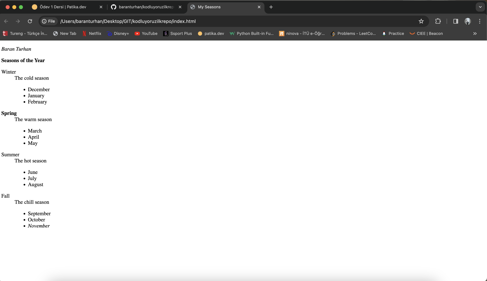

# kodluyoruzilkrepo

[Kodluyoruz]((https://www.kodluyoruz.org/)) Eğitimi kapsamında açtığım ilk repo. İçerisinde bir adet README dosyası, bir adet de index.html barındırıyor.

## Installation

Öncelikle projeyi clonelayın.
'git clone https://github.com/baranturhan/kodluyoruzilkrepo.git'

## Usage

Projeyi cloneladıktan sonra Visual Studio Code programında açınız.

Mac için:
'''
    cd kodluyoruzilkrepo
    open README.md
'''

## Contribution

Pull requestler kabul edilir. Büyük değişiklikler için, lütfen önce neyi değiştirmek istediğinizi tartışmak için bir konu açınız.

## License

MIT
